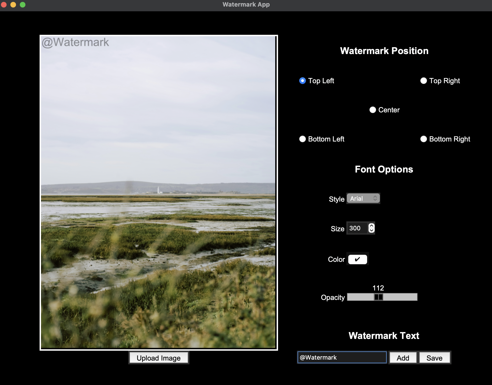

# Watermark Desktop App

The Watermark Desktop App is a user-friendly application built using the Tkinter and Pillow libraries in Python. This app allows users to easily add watermarks to their JPG or PNG images. With a simple and intuitive interface, users can customize various watermark properties such as font style, color, size, opacity, and position before saving the watermarked image.



## Reproduce the code

To use the Watermark Desktop App, follow these steps:

1. **Clone the Repository**: Clone the Watermark Desktop App repository to your local machine:

    ```bash
    git clone https://github.com/dieegogutierrez/WatermarkApp.git
    ```

2. **Navigate to the Project Directory**: Change your current directory to the root of the cloned repository:

    ```bash
    cd WatermarkApp
    ```

3. **Install Dependencies**: Install the required Python dependencies using pip. It's recommended to do this within a virtual environment to avoid conflicts with other projects:

    ```bash
    python3.9 -m venv venv
    source venv/bin/activate
    pip install -r requirements.txt
    ```

4. **Run the App**: Execute the main Python script to launch the Watermark Desktop App:

    ```bash
    python3.9 main.py
    ```

5. **Use the App**: Once the app's graphical interface appears, you can perform the following steps:

    - Click the "Upload Image" button to select an image file in JPG or PNG format.
    - Customize the watermark settings using the provided options.
    - Preview the watermarked image to ensure it meets your expectations.
    - Click the "Save" button to save the watermarked image to your desired location.

6. **Exit the App**: After you're done using the app, you can close the app window to exit.

## Features

- **Image Upload**: Users can upload images in either JPG or PNG format that they want to watermark.

- **Customizable Watermark**: Users have the flexibility to customize the watermark properties:
  - **Font Style**: Choose from a selection of fonts for the watermark text.
  - **Font Color**: Pick a suitable color for the watermark text.
  - **Font Size**: Adjust the font size to achieve the desired visibility.
  - **Opacity**: Set the opacity of the watermark text for the desired level of transparency.
  - **Position**: Select from predefined positions (e.g., top-left, bottom-right) to place the watermark on the image.

- **Preview**: Users can preview the watermarked image in real-time to make necessary adjustments before saving.

- **Save Watermarked Image**: Once satisfied with the watermark settings, users can save the watermarked image to their preferred directory.